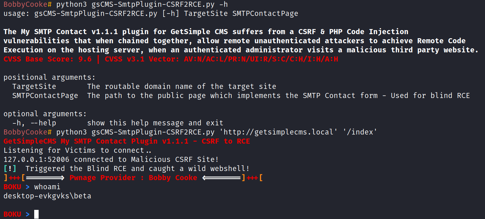

## GetSimple CMS My SMTP Contact Plugin <= v1.1.1 - CSRF to RCE
##### Exploit Author: Bobby Cooke (boku)

##### Vulnerability Statistics
+ CVSS Base Score: 9.6
+ CVSS v3.1 Vector: AV:N/AC:L/PR:N/UI:R/S:C/C:H/I:H/A:H

##### Vulnerability Description:
##### CSRF Vulnerability Information:
+ The GetSimple CMS application does not utilize the SameSite flag for the session cookie, and instead uses a CSRF token "nonce" to protect against cross-site attacks. Version of the  My SMTP Contact plugin v1.1.1 and before do not implement the CSRF token. The vendor was contacted March 28th 2021, and released v1.1.2 in response, which remediates this vulnerability by implementing the CSRF "nonce" token.
##### PHP Code Injection Vulnerability Information:
+ When the administrator configures the SMTP settings, the backend PHP code of the plugin injects the admins user input into PHP code files. These user supplied values are injected into PHP strings which use double quotes. Some features of PHP double quote strings are that variables can be expanded within the strings, and variables enclosed in {} braces will attempt to evaluate complex expressions; resulting in code execution. The method in this proof of concept also overcomes the developers attempt to sanitize the user input by using htmlspecialchars() which removes "'<> and other dangerous characters. The developer received full disclosure of this vulnerability. A simple way to remediate this issue, would be to inject the user supplied input into single quote strings, versus the double quote strings. As single quote strings do not permit variable expansion and complex expression evaluation.
##### Exploit Description:
+ The My SMTP Contact v1.1.1 plugin for GetSimple CMS suffers from a CSRF & PHP Code Injection vulnerabilities that when chained together, allow remote unauthenticated attackers to achieve Remote Code Execution on the hosting server, when an authenticated administrator visits a malicious third party website.
